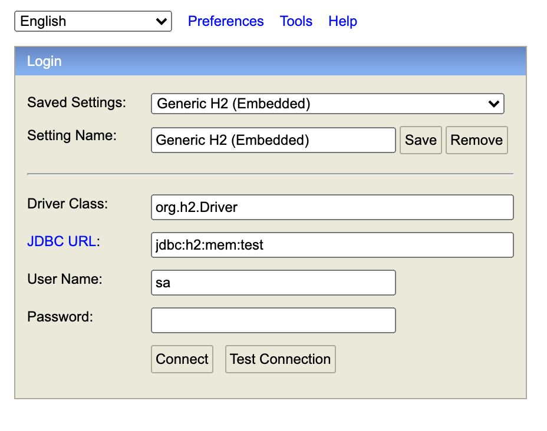

설치 및 실행 방법
--
source 다운로드  
- git clone -b master --single-branch https://github.com/liquidjoo/place-search.git

실행(프로젝트 디렉토리 안에서)  
 - ./gradlew bootRun
 
접속
 - http://localhost:8080/login
    - Id : tjdwn
    - Password : 1234

데이터베이스 접속
 - http://localhost:8080/h2
 - JDBC URL = jdbc:h2:mem:test
 - User Name = sa
 - password = 빈값
H2 데이터베이스 접속 정보  

데이터베이스 접속 정보 확인


--- 

사용한 라이브러리
--
- 롬복
    - 사용 이유
        - Api의 리스폰스인 `ResponseEntity` 의 body 값에 데이터 전달 시 객체값을 문자로 변환 하기 위해 사용(ToString Override)
        - 객체 내의 필요한 상태값을 가져올 때 @Getter를 통해 코드의 가독성을 좋게하기 위해 사용
        - LoggerFactory를 매번 설정하지 않고 @Slf4j 를 통해 코드 가독성을 높임 
    - dependency
        - ```
             compileOnly 'org.projectlombok:lombok'
             annotationProcessor 'org.springframework.boot:spring-boot-configuration-processor'
             annotationProcessor 'org.projectlombok:lombok' 
     


---

프로젝트 Tree
-
```$xslt
.
├── java  
│   └── com  
│       └── github  
│           └── liquidjoo  
│               └── placesearch  
│                   ├── PlaceSearchApplication.java  
│                   ├── PopularKeywordsRunner.java (인기 검색어 데이터 초기화) 
│                   ├── UserApplicationRunner.java (유저 정보 초기화)
│                   ├── config
│                   ├── local                      (장소 Context)
│                   ├── search                     (검색 소스 Context)
│                   ├── user                       (유저 Context)
│                   ├── utils  
│                   └── view                       (화면)
└── resources  
    ├── application.properties  
    ├── static  
    │   ├── search  
    │   │   └── search.html  
    │   └── user  
    │       └── login.html  
    ├── templates  
    └── scheme.sql
```

